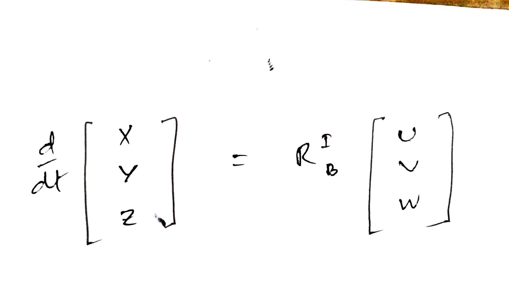

# Python Quadrotor Simulator

## The Overview 
This simulator was coded in Python to extract model geometry and aerodynamic data in the form of Pandas dataframes from openVSP files. I’ve used the Matplotlib python library to build the visual interface for observing the model during flight. The simulation can be run from the terminal using the following command - 
```
python thread_runsim.py --OpenVSP-folder <folder_path>
```
 
Replace <folder_path> with the path of the folder where the openVSP analysis files like .polar, .vspaero, .history and mass_props.txt files are located.
In this way different models can be run from different folders by changing the argument to corresponding folder path.

## File Structure
The project contains the following files of note-
- `gui.py` - The code for the graphical aspect of the project is written here. I’ve written the code for the Gui class which initializes each of its objects with a quad object and draws the 3D graph of x, y ,z axes when each object of this class is declared. It also has an update function which updates the hub and arms of the quadcopter according to the current values of the state of the quadrotor.

- Files which parse the text content of the openVSP analysis result files:
  - `Mass_props_parser.py` - Parses the `mass_props.text` file and returns the mass, Ixx, Iyy, Izz values of the model and cg coordinates.
  - `LOD_parser.py` - Parser for the `.lod` file and returns the aerodynamic data.
  - `Polar_parser.py` - Parses the `.polar` file and returns the aerodynamic coefficient data.
  - `Vspaero_parser.py` - Returns the parameters of the model geometry like Sref, Cref, Vinf, rho, number of winged components, number of propellers.

- `quadcopter.py` - The main file which describes the Quadcopter object class and its state values. It also has functions to update the state of the model during simulation by calculating the Newton-Euler equations of motion.

- `thread_runsim.py` - The file from where execution starts and where the main update loop for the GUI and quadcopter has been coded. For each update step, the quad object is updated and then the GUI object is updated to visually reflect the changes.


## Simulation Details
For simulating the model I’ve chosen 12 state variables in the form of an array with 12 elements.This state gets updated using the ode integrator from the SciPy Python package. The state variables are -
- X: X coordinate of Cg
- Y: Y coordinate of Cg
- Z: Z coordinate of Cg
- U: The body frame velocity measured along X (body axis)
- V: The body frame velocity measured along Y (body axis)
- W: The body frame velocity measured along Z (body axis)
- Phi: Body frame angle wrt Inertial X axis
- Theta: Body frame angle wrt Inertial Y axis
- Gamma: Body frame angle wrt Inertial Z axis
- P: Angular velocity wrt inertial X axis
- Q: Angular velocity wrt inertial Y axis
- R: Angular velocity wrt inertial Z axis

### Initial State Values 
The initial state values for simulation are as follows -
X		= -2 m
Y		=  0 m
Z		=  3 m
U		= -10  m/s  (quad is assumed to be in motion at the start of sim)
V		= 0 m/s
W		= 0 m/s
Phi		=  0 rad
Theta		= (pitch value to be used for model) 
Gamma	= 0 rad
P		= 0 rad/s
Q		= 0 rad/s
R		= 0 rad/s
Motor = 4000 rpm (all propellers run at same rpm , give same thrust)	

Each 15x6 propeller provides about 0.98 Kg of thrust at 4000 rpm. 


## Quadrotor Geometry parameters 
Mass - Programmatically obtained from openVSP file 
Ixx , Iyy , Izz = Programmatically obtained from openVSP file
Sref , Cref = Programmatically obtained from openVSP


## Kinetic Equations - 

1)
 
2)

 


## Newton-Euler Equations


1)
 

2)
 

## Modeling Lift and Moment due to Winged Surfaces
The lift and moment coefficients for each of the aerodynamic surfaces are programmatically obtained from openVSP files of type `.lod` and `.polar`. The data from these files are then organized into Pandas dataframes for each winged component. During the state update of the quad, the total lift and the total moment on the model due to the contributions of all the winged components are calculated in the following way:

- A best fit line is formulated from the data points in the OpenVSP `Cmy vs. alpha` and `CL vs. alpha` curves for each winged component. (OpenVSP calculates `Cmy` about the center of gravity (`cg`) of the model geometry).

- The effective Angle of Attack (AoA) for each winged component is calculated based on the pitch angle (`Theta` value of state) of the model and the incidence angle of the winged component.

- From the best fit line, the `Cmy` and `CL` for the effective AoA of each winged component are obtained. `Lift = CL * qinf * Sref` and `Moment = Cmy * qinf * Sref * Cref` are calculated for each component.

- Total lift and moment contributions to the system by all the winged components are calculated by summing lift and moment about `cg` for each component.

- These values are then used in the Newton-Euler equations.

